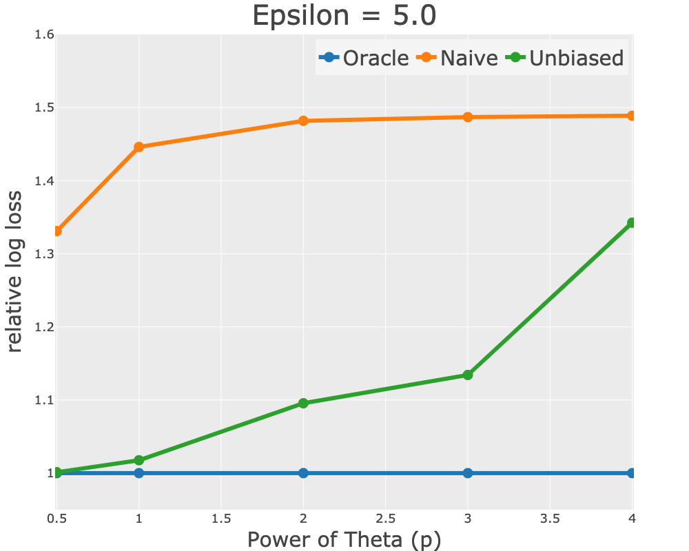
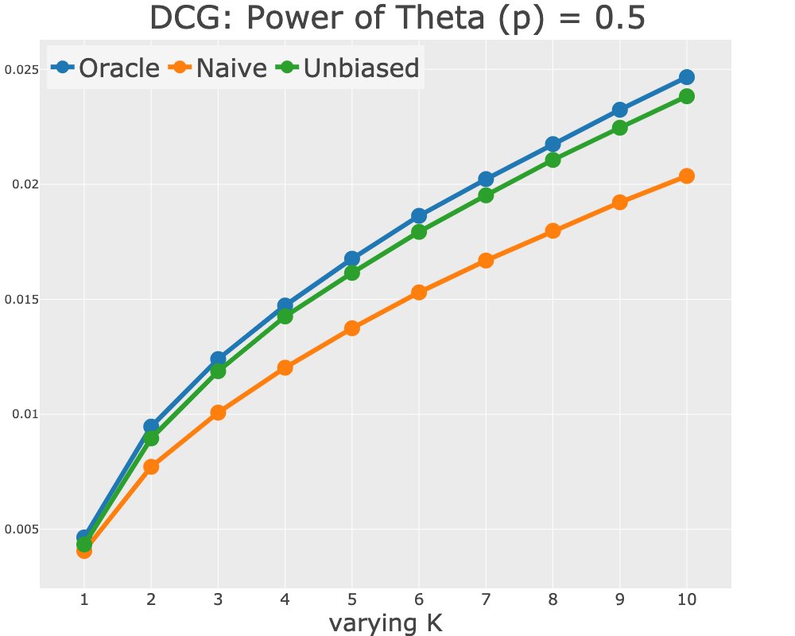
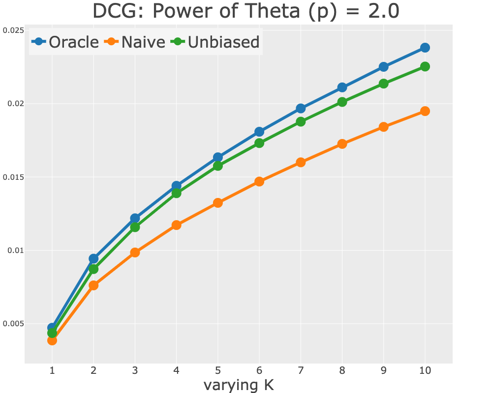
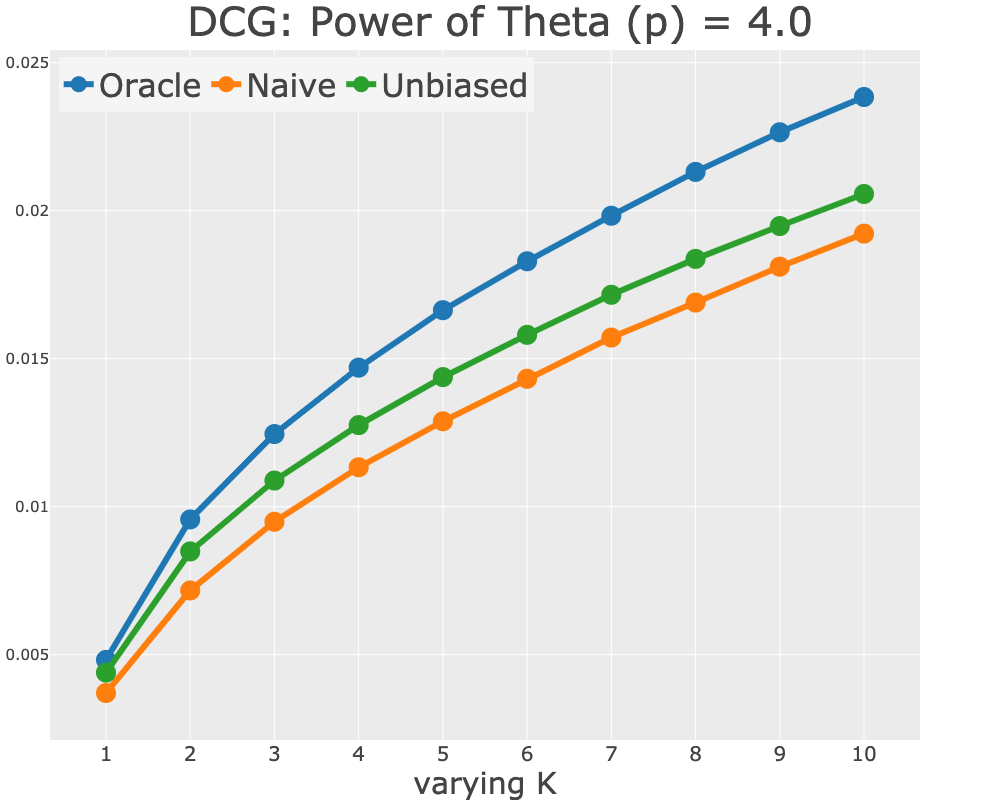

## Unbiased Recommender Learning from Missing-Not-At-Random Implicit Feedback

---

### About

This repository accompanies the semi-synthetic simulation conducted in the paper "[Unbiased Recommender Learning from Missing-Not-At-Random Implicit Feedback](https://dl.acm.org/doi/abs/10.1145/3336191.3371783)" by [Yuta Saito](https://usaito.github.io/), Suguru Yaginuma, Yuta Nishino, Hayato Sakata, and Kazuhide Nakata, which has been accepted to [WSDM'20](http://www.wsdm-conference.org/2020/index.php).

If you find this code useful in your research then please cite:

```
@inproceedings{saito2020unbiased,
  title={Unbiased Recommender Learning from Missing-Not-At-Random Implicit Feedback},
  author={Saito, Yuta and Yaginuma, Suguru and Nishino, Yuta and Sakata, Hayato and Nakata, Kazuhide},
  booktitle={Proceedings of the 13th International Conference on Web Search and Data Mining},
  pages={501--509},
  year={2020}
}
```

### Dependencies

- **python>=3.7.0**
- numpy==1.18.1
- pandas==0.25.1
- scikit-learn==0.23.1
- tensorflow==1.15.2
- plotly==3.10.0

### Running the code

To run the simulation with semi-synthetic data, download MovieLens 100K dataset from (https://grouplens.org/datasets/movielens/) and rename the `u.data` as `ml-100k.data` and put it into `data/ml-100k` directory. Then, navigate to the `src/` directory and run the command

```
for model in oracle mf rmf
do
python main.py \
  $model \
  --eps 5.0 \
  --pow_list 0.5 1.0 2.0 3.0 4.0 \
  --iters 5
done
```

This will run semi-synthetic experiments conducted in Section 5 with a fixed value of epsilon (=5) over 5 different values of power of theta (0.5, 1, 2, 3, 4). Besides, Figure1 will be generated.


After the main code is finished executing, run the following command to visualize the experimental results. Then, the figures will be stored in `/plots/` directory.

```
python visualize.py \
  --eps 5.0 \
  --pow_list 0.5 1.0 2.0 3.0 4.0
```

### Figures

By running the codes above, you can obtain the figures below.

|     Figure 1: Epsilon=0.5     |  Figure 1: Power of Theta=0.5  | Figure 1: Power of Theta=2.0  | Figure 1: Power of Theta=4.0  |
| :---------------------------: | :----------------------------: | :---------------------------: | :---------------------------: |
|  |  |  |  |

You will also have the results of other ranking metrics such as MAP and Recall.
